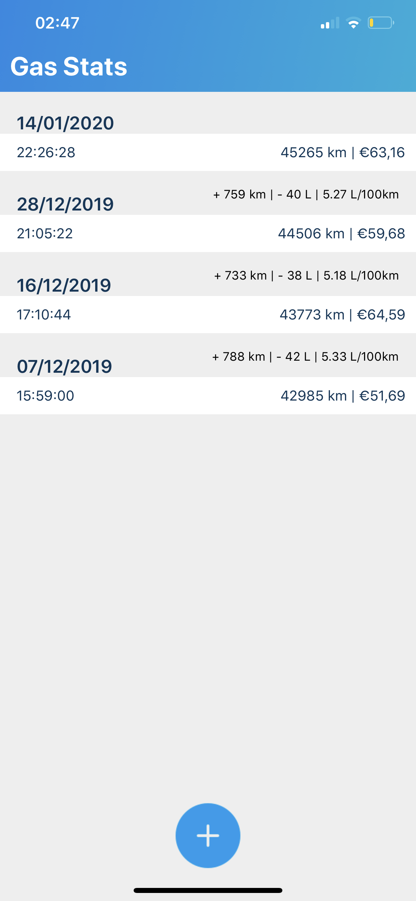
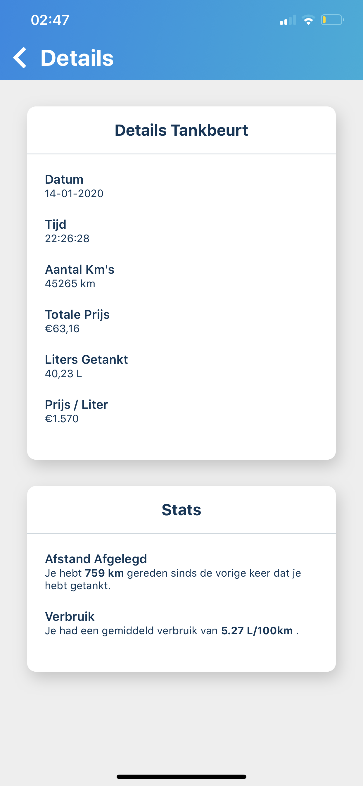
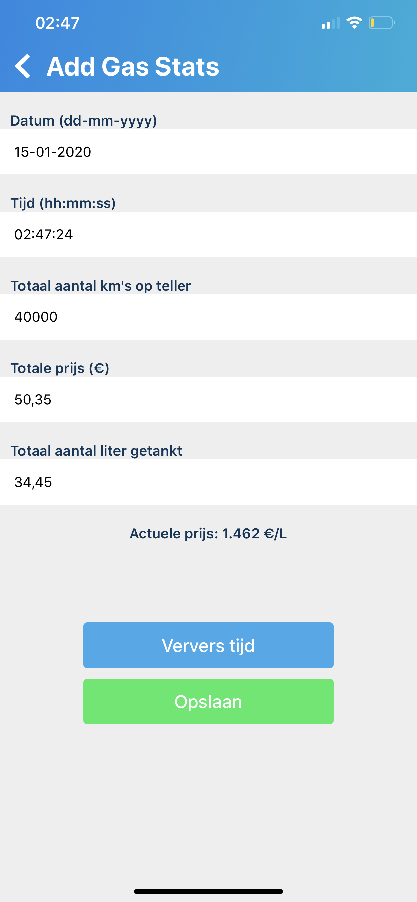

# GasStats Mobile App
I made this app for myself to track how much and when I pump gas. I use firebase mainly because I needed to be able to export it to JSON, but also just because it's easy and I don't need fancy stuff.

## Tech Used
React Native with Expo, Firebase

## Screenshots

    
    
    

 